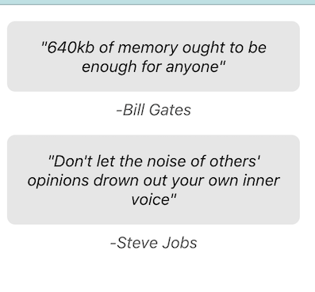

# React Exercises

## Styled Quote

Create a Quote compoment using styled components. Our designer has created a mock-up of what she wants our list of quotes to look like. 



### Your App.js should look like this:

```js
import Quote from './Quote'; 

function App() {
  return (
    <div className="App">
      <Quote by="Bill Gates" source="https://www.microsoft.com">
        640kb of memory ought to be enough for anyone
      </Quote>
      <Quote by="Steve Jobs" source="https://www.apple.com">
        Don't let the noise of others' opinions drown out your own inner voice
      </Quote>
    </div>
  );
}

export default App;
```

### Notes:

- You should have only one component (Quote.js) in addition to App.js
- Use styled components in Quote.js
- The suitable semantic HTML tags for quotes are ` <figure>`, `<blockquote>`, `<figcaption>` and `<cite>`
- See the <a href="https://developer.mozilla.org/en-US/docs/Web/HTML/Element/figure#quotations">MDN docs on quotations</a>


## Comment Card

Create a "comment card" using styled components. Our designer has created a mock-up of what she wants the list of comment cards to look like:


### Your App.js should look like this:

```js
import {useState} from 'react';
import CommentCard from './CommentCard';

function App() {

  const [comments, setComments] = useState([
    {
      imageUrl: "https://picsum.photos/100", 
      userName: "William Wise", 
      datePosted: new Date(2022, 7, 1), 
      comment: "This comment is the wisest thing you've ever read" 
    },
    {
      imageUrl: "https://picsum.photos/100/100", 
      userName: "Buddha", 
      datePosted: new Date(600, 6, 18), 
      comment: "As your focus transcends all types of objects, Unfixed on any mark of concreteness, Remain quiet, tranquil and awake!" 
    }
  ]);

  const cards = comments.map( (commentObj, i) => {
    return( 
      <CommentCard key={i}
        imageUrl={commentObj.imageUrl}
        userName={commentObj.userName} 
        datePosted={commentObj.datePosted} >
          {commentObj.comment}
      </CommentCard>
    )
  } );

  return (
    <ul>{cards}</ul>
  )

}

export default App;

```

### Notes:

- You should have only one component (CommentCard.js) in addition to App.js
- Use styled components in CommentCard.js
- Use <a href="https://day.js.org/">dayjs</a> and its <a href="https://day.js.org/docs/en/plugin/relative-time">Relative Time</a> plugin to display the 'ago' text
- The image will need to receive its source as a prop. Find out how to pass a tag attribute as a prop to a styled compoment <a href="https://styled-components.com/docs/faqs#when-to-use-attrs">here</a>


## Dynamic Search Filter

## 

